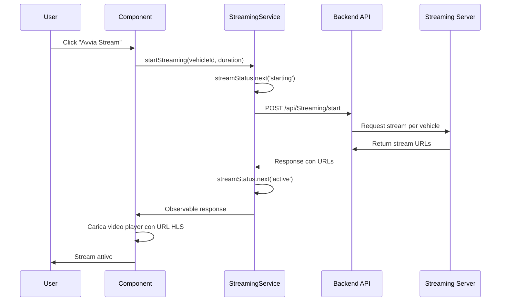
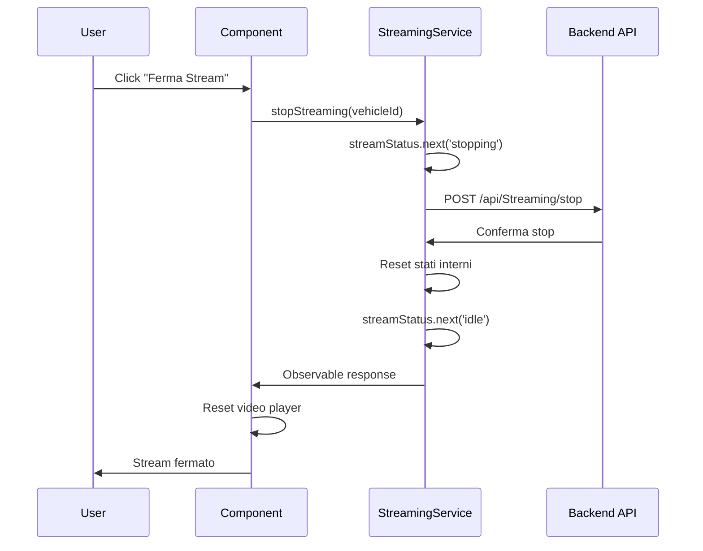
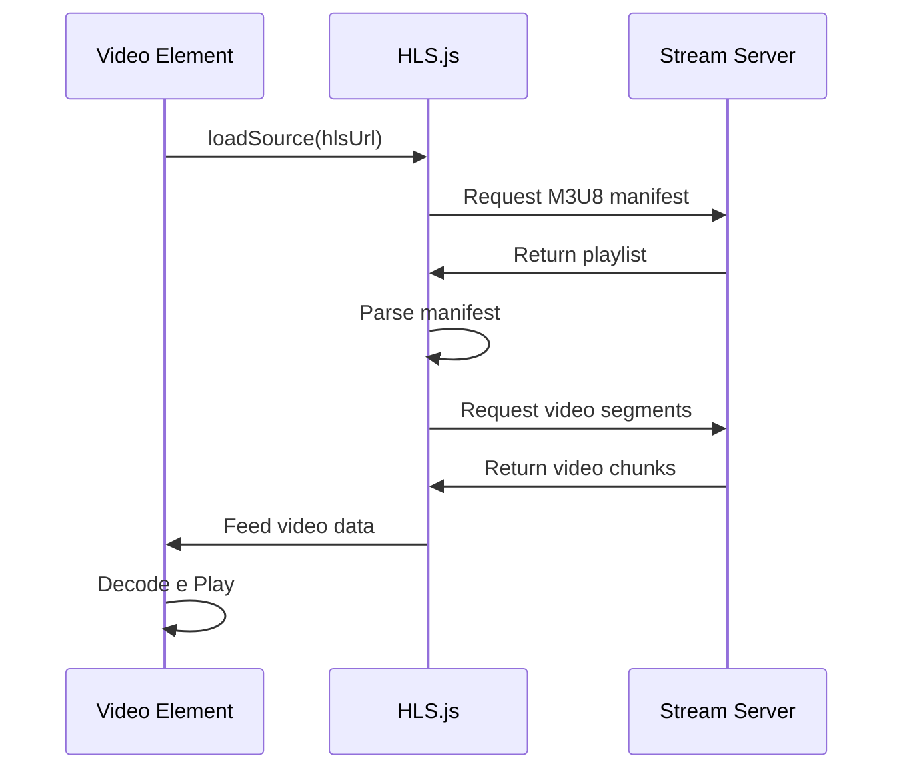

# 📺 Documentazione Sistema Streaming

## 🎯 Panoramica

Il sistema di streaming dell'applicazione di tracking permette la visualizzazione in tempo reale di video stream dai veicoli utilizzando protocolli HLS, WebRTC e RTSP. Il sistema è composto da diversi componenti che gestiscono l'intero flusso dalla richiesta di avvio stream alla riproduzione video.

## 🏗️ Architettura del Sistema

```
┌─────────────────────────────────────────────────────────────────┐
│                    FRONTEND ANGULAR                             │
├─────────────────────────────────────────────────────────────────┤
│  StreamingTestComponent     │  TestStreamCamComponent           │
│  (Player HLS Avanzato)      │  (Player HLS + Webcam + Test)    │
├─────────────────────────────────────────────────────────────────┤
│                    StreamingService                              │
│  (Gestione API e Stati)                                        │
├─────────────────────────────────────────────────────────────────┤
│                    ConfigService                                │
│  (Configurazione URL API)                                      │
└─────────────────────────────────────────────────────────────────┘
                              │
                              ▼
┌─────────────────────────────────────────────────────────────────┐
│                    BACKEND API                                  │
├─────────────────────────────────────────────────────────────────┤
│  /api/Streaming/start       │  /api/Streaming/stop             │
│  /api/Streaming/status      │  /api/Streaming/{other}          │
└─────────────────────────────────────────────────────────────────┘
                              │
                              ▼
┌─────────────────────────────────────────────────────────────────┐
│                    STREAMING SERVER                             │
│  (Genera URL HLS/WebRTC/RTSP)                                  │
└─────────────────────────────────────────────────────────────────┘
```

## 📁 Struttura File

```
src/app/
├── features/vehicles/
│   ├── streaming-test.component.ts     # Componente player avanzato
│   ├── teststreamcam.ts               # Componente test completo
│   └── modals/
│       └── veicle-modal.ts            # Modal veicoli (integrazione)
├── services/
│   ├── streaming.service.ts           # Servizio gestione streaming
│   └── config.service.ts              # Servizio configurazione
├── models/
│   └── stream.ts                      # Interfacce streaming
└── assets/
    └── config.json                    # Configurazione API
```

## 🔧 Configurazione

### config.json

```json
{
  "apiBaseUrl": "http://10.0.90.9/Stage/TrackingApp",
  "api": {
    "endpoints": {
      "streamStart": "/api/Streaming/start",
      "streamStop": "/api/Streaming/stop",
      "streamStatus": "/api/Streaming/status"
    }
  }
}
```

### Modelli TypeScript

#### IStreaming Interface

```typescript
// src/app/models/stream.ts
export interface IStreaming {
  success: boolean;
  message?: string;
  data?: {
    vehicleId: number;
    startedAt: Date | string;
    expiresAt: Date | string;
    durationSeconds: number;
    urls?: {
      hls?: string; // URL stream HLS (priorità)
      webRtc?: string; // URL stream WebRTC
      rtsp?: string; // URL stream RTSP
    };
    playerConfig?: {
      recommendedPlayer: string;
      hls?: {
        autoPlay: boolean;
        controls: boolean;
      };
    };
  };
}
```

## 🎯 StreamingService

### Responsabilità

- Gestione chiamate API per streaming
- Mantenimento stato streaming
- Notifica cambiamenti di stato
- Reset e cleanup risorse

### Codice Principale

```typescript
@Injectable({
  providedIn: 'root',
})
export class StreamingService {
  private http = inject(HttpClient);
  private configService = inject(ConfigService);

  // Signals per stato reattivo
  isStreamActive = signal(false);
  currentStreamData = signal<IStreaming | null>(null);
  streamError = signal<string | null>(null);

  // BehaviorSubject per notifiche
  private streamStatusSubject = new BehaviorSubject<
    'idle' | 'starting' | 'active' | 'stopping' | 'error'
  >('idle');
  streamStatus$ = this.streamStatusSubject.asObservable();

  /** Avvia lo streaming per un veicolo */
  startStreaming(vehicleId: number, durationSeconds?: number): Observable<IStreaming> {
    const url = this.configService.getApiUrl('streamStart');
    let params = new HttpParams().set('vehicleId', vehicleId.toString());

    if (durationSeconds) {
      params = params.set('durationSeconds', durationSeconds.toString());
    }

    this.streamStatusSubject.next('starting');
    this.streamError.set(null);

    return new Observable<IStreaming>((observer) => {
      this.http.post<IStreaming>(url, {}, { params }).subscribe({
        next: (response) => {
          this.currentStreamData.set(response);
          this.isStreamActive.set(true);
          this.streamStatusSubject.next('active');
          observer.next(response);
          observer.complete();
        },
        error: (error) => {
          this.streamError.set(error.message || 'Failed to start streaming');
          this.streamStatusSubject.next('error');
          this.isStreamActive.set(false);
          observer.error(error);
        },
      });
    });
  }

  /** Ferma lo streaming */
  stopStreaming(vehicleId: number): Observable<any> {
    const url = this.configService.getApiUrl('streamStop');
    const params = new HttpParams().set('vehicleId', vehicleId.toString());

    this.streamStatusSubject.next('stopping');

    return new Observable((observer) => {
      this.http.post(url, {}, { params }).subscribe({
        next: (response) => {
          this.currentStreamData.set(null);
          this.isStreamActive.set(false);
          this.streamStatusSubject.next('idle');
          this.streamError.set(null);
          observer.next(response);
          observer.complete();
        },
        error: (error) => {
          this.streamError.set(error.message || 'Failed to stop streaming');
          this.streamStatusSubject.next('error');
          observer.error(error);
        },
      });
    });
  }

  /** Verifica stato streaming */
  getStreamingStatus(vehicleId: number): Observable<any> {
    const url = this.configService.getApiUrl('streamStatus');
    const params = new HttpParams().set('vehicleId', vehicleId.toString());
    return this.http.get(url, { params });
  }
}
```

## 🎬 StreamingTestComponent

### Caratteristiche

- Player HLS avanzato con gestione eventi
- UI responsive con feedback visivo
- Gestione errori dettagliata
- Support per controlli video nativi

### Flusso di Utilizzo

```typescript
export class StreamingTestComponent implements OnInit, OnDestroy {
  // Signals reattivi
  isStreamActive = signal(false);
  streamData = signal<IStreaming | null>(null);
  streamError = signal<string | null>(null);
  streamStatus = signal<'idle' | 'starting' | 'active' | 'stopping' | 'error'>('idle');
  videoStatus = signal<'loading' | 'ready' | 'playing' | 'error' | null>(null);

  startStream() {
    if (this.isLoading() || this.isStreamActive()) return;

    this.streamingService.startStreaming(this.vehicleId(), 300).subscribe({
      next: (response) => {
        this.streamData.set(response);
        this.isStreamActive.set(true);
        // Video player si attiva automaticamente con l'URL HLS
      },
      error: (error) => {
        this.streamError.set(error.message);
        this.videoStatus.set('error');
      },
    });
  }

  // Eventi del video player
  onVideoLoadStart() {
    this.videoStatus.set('loading');
  }

  onVideoLoaded() {
    this.videoStatus.set('ready');
  }

  onVideoCanPlay() {
    this.videoStatus.set('playing');
  }

  onVideoError(event: any) {
    this.videoStatus.set('error');
    // Gestione errori specifici del video player
  }
}
```

## 🧪 TestStreamCamComponent

### Caratteristiche

- Player HLS professionale con hls.js
- Stream di test da Mux integrato
- Webcam locale per confronto
- Configurazione HLS avanzata

### Configurazione HLS

```typescript
private readonly HLS_CONFIG = {
  debug: true,           // Logging dettagliato
  enableWorker: true,    // Web Worker per performance
  lowLatencyMode: true,  // Modalità bassa latenza
  backBufferLength: 90   // Buffer video (secondi)
};

private readonly TEST_STREAM_URL =
  'https://test-streams.mux.dev/x36xhzz/x36xhzz.m3u8';
```

### Caricamento Dinamico hls.js

```typescript
private async loadHlsLibrary() {
  if (typeof Hls === 'undefined') {
    const script = document.createElement('script');
    script.src = 'https://cdn.jsdelivr.net/npm/hls.js@latest';
    script.onload = () => {
      this.hlsPlayerStatus.set('Libreria HLS caricata');
    };
    document.head.appendChild(script);
  }
}
```

### Implementazione Player HLS

```typescript
startTestHlsStream() {
  const video = this.hlsTestVideo.nativeElement;

  if (Hls.isSupported()) {
    // Browser con supporto hls.js
    this.hlsPlayer = new Hls(this.HLS_CONFIG);

    // Event listeners
    this.hlsPlayer.on(Hls.Events.MEDIA_ATTACHED, () => {
      this.hlsPlayerStatus.set('Media collegato');
    });

    this.hlsPlayer.on(Hls.Events.MANIFEST_PARSED, () => {
      this.hlsPlayerStatus.set('Manifest caricato');
      video.play().then(() => {
        this.isTestHlsActive.set(true);
        this.hlsPlayerStatus.set('Riproduzione avviata');
      });
    });

    this.hlsPlayer.on(Hls.Events.ERROR, (event, data) => {
      this.testHlsError.set(`Errore HLS: ${data.type} - ${data.details}`);
    });

    // Avvia streaming
    this.hlsPlayer.attachMedia(video);
    this.hlsPlayer.loadSource(this.TEST_STREAM_URL);

  } else if (video.canPlayType('application/vnd.apple.mpegurl')) {
    // Safari con supporto nativo HLS
    video.src = this.TEST_STREAM_URL;
    video.play().then(() => {
      this.isTestHlsActive.set(true);
      this.hlsPlayerStatus.set('Riproduzione nativa avviata');
    });
  }
}
```

## 🔄 Flussi di Lavoro

### 1. Flusso Avvio Stream



### 2. Flusso Stop Stream



### 3. Flusso Player HLS



## 🎛️ Gestione Stati

### Stati del Servizio

- **idle**: Nessuno stream attivo
- **starting**: Avvio stream in corso
- **active**: Stream attivo e funzionante
- **stopping**: Stop stream in corso
- **error**: Errore durante operazioni

### Stati del Video Player

- **loading**: Caricamento video
- **ready**: Video pronto per riproduzione
- **playing**: Video in riproduzione
- **error**: Errore nel player

### Sincronizzazione Stati

```typescript
ngOnInit() {
  // Sottoscrizione reattiva agli stati del servizio
  this.statusSubscription = this.streamingService.streamStatus$
    .subscribe((status) => {
      this.streamStatus.set(status);
      this.isLoading.set(status === 'starting' || status === 'stopping');
    });

  // Sincronizzazione iniziale
  this.syncWithService();
}

private syncWithService() {
  this.isStreamActive.set(this.streamingService.getIsStreamActive());
  this.streamData.set(this.streamingService.getCurrentStreamData());
  this.streamError.set(this.streamingService.getStreamError());
}
```

## 🛠️ Gestione Errori

### Errori API

```typescript
// Errori HTTP durante chiamate API
error: (error) => {
  let errorMessage = 'Impossibile avviare lo stream';

  if (error.status === 400) {
    errorMessage = 'Richiesta non valida - Controlla parametri';
  } else if (error.status === 404) {
    errorMessage = 'Veicolo non trovato';
  } else if (error.status === 500) {
    errorMessage = 'Errore del server';
  }

  this.streamError.set(errorMessage);
};
```

### Errori Video Player

```typescript
onVideoError(event: any) {
  const videoError = event.target?.error;
  let errorMessage = 'Errore nel player video';

  switch (videoError?.code) {
    case 1: errorMessage = 'Riproduzione interrotta dall\'utente'; break;
    case 2: errorMessage = 'Errore di rete durante caricamento'; break;
    case 3: errorMessage = 'Errore di decodifica video'; break;
    case 4: errorMessage = 'Formato video non supportato'; break;
  }

  this.streamError.set(errorMessage);
}
```

### Errori HLS

```typescript
this.hlsPlayer.on(Hls.Events.ERROR, (event, data) => {
  console.error('[HLS] Errore:', data);

  if (data.fatal) {
    switch (data.type) {
      case Hls.ErrorTypes.NETWORK_ERROR:
        this.testHlsError.set('Errore di rete fatale');
        break;
      case Hls.ErrorTypes.MEDIA_ERROR:
        this.testHlsError.set('Errore media fatale');
        break;
      default:
        this.testHlsError.set('Errore fatale sconosciuto');
    }
  }
});
```

## 🔧 Debugging e Logging

### Logging Strutturato

```typescript
// Logging con prefissi per identificazione
console.log('[STREAMING-SERVICE] Starting stream for vehicle:', vehicleId);
console.log('[HLS-TEST] Manifest parsed');
console.error('[VIDEO-PLAYER] Errore nel video:', event);
```

### Debug HLS

```typescript
private readonly HLS_CONFIG = {
  debug: true,  // Abilita logging dettagliato hls.js
  // ... altre configurazioni
};
```

## 🚀 Deployment e Performance

### Ottimizzazioni

1. **Lazy Loading**: hls.js caricato dinamicamente
2. **Error Recovery**: Gestione fallback per browser diversi
3. **Memory Management**: Cleanup risorse in ngOnDestroy
4. **Responsive Design**: UI adattiva per mobile

### Browser Support

- **Chrome/Firefox**: hls.js per supporto HLS
- **Safari**: Supporto HLS nativo
- **Edge**: hls.js con fallback
- **Mobile**: Supporto nativo su iOS, hls.js su Android

## 📋 Checklist Implementazione

### ✅ Completato

- [x] StreamingService con gestione stati
- [x] StreamingTestComponent con player avanzato
- [x] TestStreamCamComponent con HLS + webcam + test Mux
- [x] Gestione errori completa
- [x] UI responsive e accessibile
- [x] Logging strutturato
- [x] Configurazione centralizzata

### 🔄 Possibili Miglioramenti

- [ ] Integrazione WebRTC per bassa latenza
- [ ] Supporto sottotitoli e tracce audio multiple
- [ ] Analytics streaming (bitrate, qualità, buffering)
- [ ] Picture-in-Picture mode
- [ ] Registrazione stream locale
- [ ] Streaming multipli simultanei

## 📞 API Reference

### Endpoints

#### POST /api/Streaming/start

**Avvia streaming per un veicolo**

```http
POST /api/Streaming/start?vehicleId=123&durationSeconds=300
Content-Type: application/json
```

Response:

```json
{
  "success": true,
  "data": {
    "vehicleId": 123,
    "startedAt": "2025-10-16T14:30:00Z",
    "expiresAt": "2025-10-16T14:35:00Z",
    "durationSeconds": 300,
    "urls": {
      "hls": "https://stream.example.com/vehicle123/playlist.m3u8",
      "webRtc": "wss://stream.example.com/vehicle123/webrtc",
      "rtsp": "rtsp://stream.example.com/vehicle123"
    }
  }
}
```

#### POST /api/Streaming/stop

**Ferma streaming**

```http
POST /api/Streaming/stop?vehicleId=123
```

#### GET /api/Streaming/status

**Verifica stato streaming**

```http
GET /api/Streaming/status?vehicleId=123
```

## 🎯 Conclusioni

Il sistema di streaming implementato fornisce una soluzione completa e robusta per la visualizzazione di video stream in tempo reale. La combinazione di Angular Signals, RxJS e hls.js garantisce performance ottimali e un'esperienza utente fluida.

I componenti sono modulari e riutilizzabili, permettendo facile integrazione in diverse parti dell'applicazione. La gestione degli errori è comprensiva e user-friendly, mentre il sistema di logging facilita il debugging e il monitoraggio.
